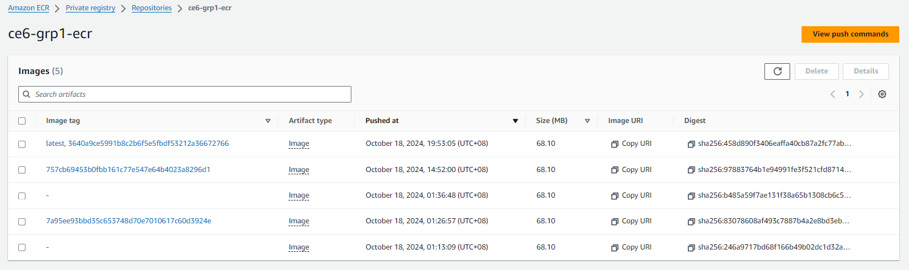
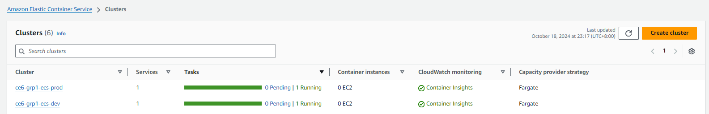
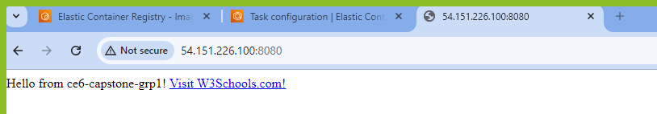

<h1>Capstone Project: CI/CD Pipeline for Web App Deployment on AWS ECS</h1>

<h3>Project Team</h3>
<ul>
    <li><strong>Jyoti</strong> Rani</li>
    <li><strong>Keren</strong> Priya</li>
    <li>Bakthavachalam<strong> Saravanan</strong></li>
    <li>Vedarethinam<strong> Vennila</strong></li>
</ul>

Students of PaCE@NTU enrolled in the SCTP Cloud Infrastructure Engineering course.

<h3>Project Overview</h3>
<ul>
    <li><strong>Project Name:</strong> CI/CD Pipeline for Web App Deployment on AWS ECS</li>
    <li><strong>Repository:</strong> GitHub Repository - https://github.com/Saravanannus/ce6-capstone-grp1</li>
</ul>

This project automates the deployment of a Node.js application using Docker on Amazon ECS, utilizing GitHub Actions for Continuous Integration and Continuous Deployment (CI/CD) and HCP Terraform for infrastructure provisioning.

<h3>Project Objectives</h3>
<ul>
    <li>Implement a CI/CD pipeline using GitHub Actions for automated building, testing, and deployment of a Dockerized application to AWS ECS.</li>
    <li>Provision and manage AWS infrastructure using HCP Terraform, ensuring reliable and scalable application deployment.</li>
</ul>

<h3>Architecture Diagram</h3>

The architecture diagram below depicts the project's structure and interactions between components:

The architecture consists of a Node.js application running in Docker containers on Amazon ECS, with a CI/CD pipeline configured through GitHub Actions.

<h3>Getting Started</h3>
<h4>Tools and Technologies Used:</h4>

##Setup Terraform Cloud: ##
- Link Terraform Cloud with your repository.
- Define workspaces for dev and prod.

## List of AWS Resources used in this Project: ##

**1. GitHub Actions** – Automates the CI/CD pipeline for building, testing, and deploying the application.

**2. IAM Roles and Policies** – Manages access and permissions for AWS resources between ECS and GitHub Actions, ensuring secure access.

**3.** Infrastructure as Code (IaC):
Terraform Cloud manages the infrastructure definitions for both environments.

**4. Amazon ECR** – Stores Docker images for different environments (dev, prod).

**5. Amazon ECS Fargate** – Runs containerized services without managing infrastructure.

**6. Networking and Security** – Each ECS cluster is deployed within a VPC using public subnets and security groups. 
The security group allows HTTP traffic on port 8080 to access the running containers.

**7. VPC and Public Subnets** – Provides networking and connectivity for the ECS tasks.

<h4>Dependencies:</h4>
<ul>
    <li>index.js</li>
    <li>Express</li>
    <li>Jest (for testing)</li>
    <li>Docker</li>
</ul>

<h4>Application Structure</h4>
<pre>
/ce6-capstone-grp1
|-- terraform
    |-- dev
        |-- infra
            |-- main.tf
            |-- provider.tf
            |-- version.tf
    |-- prod
        |-- infra
            |-- main.tf
            |-- provider.tf
            |-- version.tf
|-- .gitignore
|-- Dockerfile
|-- README.md
|-- index.js
|-- package.json
|-- package-lock.json
|-- sum.test.js
</pre>

<h3>Project Development Details</h3>
<h4>Steps Overview</h4>
<ol>
    </li>
    <li><strong>Set up AWS credentials globally in GitHub Secrets:</strong>
        <ul>
            <li>AWS_ACCESS_KEY_ID</li>
            <li>AWS_SECRET_ACCESS_KEY</li>
        </ul>
    </li>
    <li><strong>Set Up GitHub Variables:</strong> Ensure that the following environment-specific variables are set in GitHub Repository Settings:
        <ul>
            <li>ECR_REPOSITORY (for both dev and prod)</li>
            <li>ECS_SERVICE (for both dev and prod)</li>
            <li>ECS_CLUSTER (for both dev and prod)</li>
            <li>AWS_REGION (for both dev and prod)</li>
        </ul>
    <li><strong>Push Changes and Merge Feature Branch into Main:</strong>
        <ul>
            <li>Develop the feature in a feature branch and push the changes.</li>
            <li>Create a Pull Request (PR) to merge the feature branch into the main branch.</li>
            <li>Merge the PR into the main branch.</li>
        </ul>
    </li>
    <li><strong>Run Terraform Plan and Apply using HCP Terraform:</strong>
        <ul>
            <li>After changes are merged into the main branch, use HCP Terraform to plan and apply infrastructure changes.</li>
            <li>HCP Terraform should be integrated into the workflow to:
                <ul>
                    <li>Plan changes to AWS resources like ECS services, ECR repositories, etc.</li>
                    <li>Apply the infrastructure changes if the plan looks good.</li>
                </ul>
            </li>
        </ul>
    </li>
    <li><strong>Trigger GitHub Actions Manually:</strong>
        <ul>
            <li>Once the infrastructure is updated, trigger the GitHub Action workflow manually to deploy the ECS application.</li>
            <li>The GitHub Action should:
                <ul>
                    <li>Pull the latest image from the ECR_REPOSITORY.</li>
                    <li>Update the ECS service in the target environment.</li>
                </ul>
            </li>
        </ul>
    </li>
</ol>

<h3>Docker Setup for the Application</h3>

The application is containerized using Docker. Below is the Dockerfile that describes how to build the application image.

<h4>Dockerfile</h4>
<pre>
FROM node:16-alpine
WORKDIR /my-app
COPY package*.json ./
RUN npm install
COPY . .
EXPOSE 8080
CMD ["node", "index.js"]
</pre>

<h4>Application Code (index.js)</h4>
<pre>
'use strict';
const express = require('express');
const PORT = 8080;
const HOST = '0.0.0.0';
const app = express();

app.get('/', (req, res) => {
  res.send('Hello from ce6-capstone-grp1!');
});

app.listen(PORT, HOST);
console.log(`Running on http://${HOST}:${PORT}`);
</pre>

<h3>CI/CD Pipeline</h3>
<h4>1. GitHub Actions Workflow for Continuous Deployment</h4>

This workflow automates building, testing, and deploying a Dockerized application to Amazon ECS. It consists of two main jobs: one for building the Docker image and pushing it to Amazon ECR, and the other for deploying the application to the ECS cluster in both development and production environments.

<h4>AWS ECR (Elastic Container Registry):</h4>

Purpose: Stores Docker images that are tagged with version identifiers such as latest or specific commit SHAs (e.g., :abc123).

Integration: GitHub Actions authenticates with ECR and pushes images to designated repositories based on the environment (dev or prod).

AWS Fargate Tasks & Services
ECS services run containerized applications inside Fargate tasks, each exposed on port 8080.

Networking Components
VPC with Public Subnets: Each cluster resides inside a Virtual Private Cloud (VPC) with public-facing subnets.
Security Groups: Allow inbound HTTP traffic on port 8080 and permit all outbound traffic.

<h4>ci-cd.yml Workflow File</h4>

<strong>Trigger:</strong> The workflow is triggered manually (<code>workflow_dispatch</code>), allowing for on-demand deployments.

<strong>Environment Variables:</strong> Set for easier reuse of names and identifiers like container names, regions, and repository names.

<h4>Jobs Overview:</h4>
<ul>
    <li><strong>build-image:</strong> This job builds a Docker image, pushes it to Amazon ECR, and stores the image tag as an artifact.
        <ul>
            <li><strong>Steps:</strong>
                <ol>
                    <li>Clone the Repository.</li>
                    <li>Checkout the code.</li>
                    <li>Install dependencies (Node.js and npm).</li>
                    <li>Run tests with <code>npm test</code>.</li>
                    <li>Configure AWS credentials using GitHub secrets.</li>
                    <li>Build the Docker image, tag it, and push it to Amazon ECR.</li>
                    <li>Save the image information for the deployment job.</li>
                </ol>
            </li>
        </ul>
    </li>
    <li><strong>deploy-dev and deploy-prod:</strong> These jobs deploy the Docker image to ECS for the dev and prod environments, respectively.
        <ul>
            <li><strong>Steps:</strong>
                <ol>
                    <li>Download the image information artifact.</li>
                    <li>Output the image URL.</li>
                    <li>Retrieve the ECS task definition.</li>
                    <li>Update the task definition with the new Docker image.</li>
                    <li>Deploy the updated task definition to ECS.</li>
                </ol>
            </li>
        </ul>
    </li>
</ul>

<h3>Terraform for AWS (ECS) Infrastructure</h3>

Terraform is used to provision and configure AWS infrastructure for the ECS service. The environment folders (<strong>dev/infra</strong> and <strong>prod/infra</strong>) contain configuration files to set up ECS clusters, security groups, and ECS services.

<h4>Key AWS Resources by Terraform:</h4>
<ul>
    <li>AWS ECS Cluster</li>
    <li>AWS ECS Task Definitions</li>
    <li>AWS ECS Services</li>
    <li>Security Groups</li>
</ul>
Outputs:

Images stored on ECR:

Dev and Prod Clusters in ECS:

This will expose the application, allowing to access it at http://localhost:8080 in a web browser.

<h3>Conclusion</h3>

This capstone project showcases our ability to deploy an application using best practices in CI/CD automation, infrastructure-as-code with HCP Terraform, and cloud service management with AWS ECS. We have successfully met the project objectives, and our implementation allows for future scaling and optimization.

</body>
</html>
